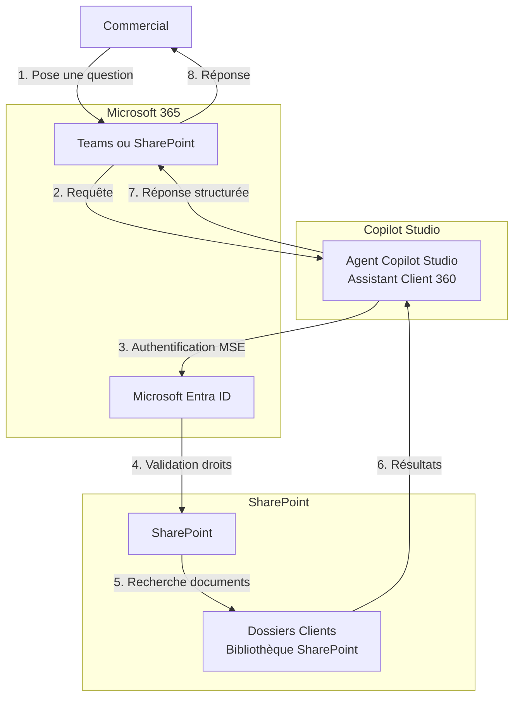

# Architecture POC — Scénario A

## Vue d'Ensemble

Ce document décrit l'architecture POC pour l'Assistant Client 360 dans le scénario A : **Copilot Studio + SharePoint uniquement**.

## Diagramme d'Architecture



## Composants de l'Architecture

### 1. Interface Utilisateur

- **Teams** : Canal principal recommandé
- **SharePoint** : Alternative disponible (depuis Mai 2025)

### 2. Agent Copilot Studio

- Nom : "Assistant Client 360"
- Source de connaissance : SharePoint
- Authentication : Microsoft (intégrée)

### 3. SharePoint

- Site cible : Bibliothèque des dossiers clients
- Permissions : Utilisées comme base de sécurité

## Pourquoi Cette Architecture Est Suffisante pour un POC

### Avantages

1. **Simplicité** : Aucun composant supplémentaire
2. **Sécurité intégrée** : Permissions SharePoint existantes
3. **Déploiement rapide** : Quelques heures de configuration
4. **Coût minimal** : Licences Microsoft 365 existantes
5. **Maintenance réduite** : Pas d'infrastructure externe

### Ce Qu'Elle Permet

- Résumé de dossiers clients
- Recherche documentaire automatique
- Préparation de synthèses avant rendez-vous
- Génération de brouillons de mails
- Identification de points d'attention

### Ce Qu'Elle Ne Permet Pas Encore

- Recherche cross-SharePoint (un seul site à la fois)
- Indexation centralisée multi-sites
- Métadonnées structurées自动matisées
- Tableaux de bord analytiques
- Alerts sur nouveaux documents

## Pourquoi On Avoid Azure AI Search

### Pour le POC

- **Complexité** : Nécessite configuration Azure supplémentaire
- **Coût** : Ressources Azure à provisionner
- **Compétences** : Expertise Azure requise
- **Temps** : Déploiement plus long
- **Non demandé** : Scénario A uniquement

### Recommandation

- Démarrer avec Scénario A
- Évaluer la valeur métier
- Considérer Azure AI Search uniquement si POC démontrable et scalabilité nécessaire

## Pourquoi On Avoid Microsoft Purview

### Pour le POC

- **Complexité** : Configuration Purview significative
- **Licence** : Supplementaire nécessaire
- **Non demandé** : Sécurité SharePoint de base suffisante
- **Temps** : Déploiement plus long
- **Focus** : Valeur métier rapide prioritaire

### Recommandation

- Utiliser les permissions SharePoint existantes
- Checklist sécurité SharePoint de base (Phase 4)
- Considérer Purview uniquement pour extension future

## Flux Utilisateur

```
1. Commercial se connecte à Teams
2. Il chuchote l'agent "Assistant Client 360"
3. Il pose une question : "Résume-moi le dossier client ABC"
4. L'agent vérifie ses permissions SharePoint
5. L'agent recherche dans les documents autorisés
6. L'agent synthétise la réponse
7. Il Cite les sources
8. Le commercial reçoit la réponse structurée
```

## Éléments Techniques Requis

### Licences

- Microsoft 365 Business ou Enterprise
- Copilot Studio (inclus dans Microsoft 365)
- (Optionnel) Microsoft 365 Copilot recommandée pour tenant graph grounding

### Permissions Requises

- Accès à Copilot Studio
- Accès au site SharePoint cible
- Droits sur les bibliothèques documentaires

### Configuration Minimale

1. Créer l'agent Copilot Studio
2. Ajouter SharePoint comme source de connaissance
3. Configurer les instructions de l'agent
4. Publier dans Teams ou SharePoint

## Limites Connues

- Un seul site SharePoint par source (possible d'en ajouter 4)
- Dépendance aux permissions SharePointuelles
- Latence possible selon indexation SharePoint
- Pas de garantie de complétude des résultats

---

*Document créé : 2026-04-28 - Architecture POC Scénario A*