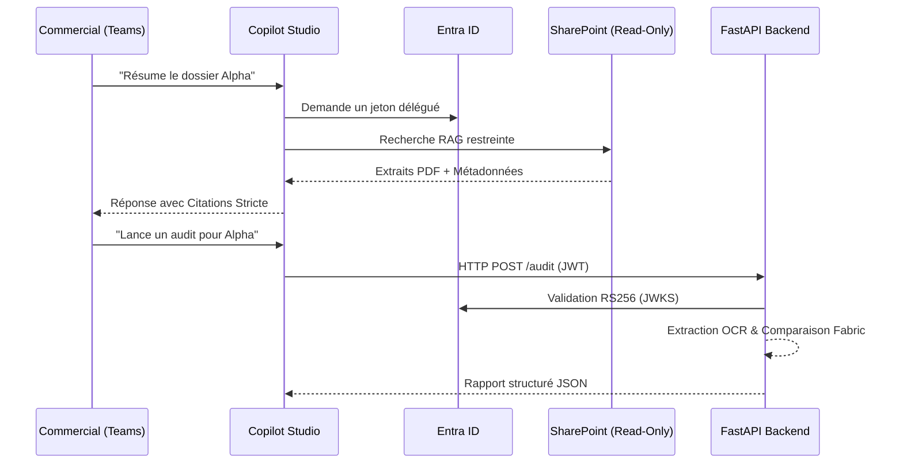

# AC360 — Architecture Globale & Sécurité

> **Statut** : pilote pré-go-live. La décision GO / NO-GO est gouvernée par la
> checklist `docs/production/runbooks/07-go-no-go-checklist.md` (preuves :
> `docs/security/SECURITY_POSTURE.md`, registre de risques acceptés
> `docs/security/SEC-05-accepted-risk-register.md`, et la DPIA RGPD) — pas par un
> état figé. Le backend **staging est déployé** et l'OBO / OCR / Fabric ont été
> exercés de bout en bout (cf. `docs/security/SECURITY_REDTEAM_STAGING_2026-06.md`).
> **Version** : 2.0 (Post-Audit Hostile)

## Vue d'ensemble

AC360 est un assistant conversationnel pour Microsoft Teams, propulsé par **Microsoft Copilot Studio**, et conçu pour les équipes commerciales. Il s'appuie exclusivement sur les données documentaires **SharePoint** de l'entreprise via l'architecture RAG (Retrieval-Augmented Generation).

## Composants Principaux

1. **Front-End : Microsoft Teams / Copilot UI**
   - Canal exclusif de déploiement (SSO natif).
2. **Cerveau Conversationnel : Copilot Studio**
   - Gère le flux du dialogue (Topics : `Rsumdossierclient`, `Search`, etc.).
   - Utilise l'action `SearchAndSummarizeContent` (RAG natif).
3. **Moteur d'Identité : Microsoft Entra ID**
   - Protection de bout en bout de l'API Backend via JWT RS256.
   - Accès délégué de Copilot à SharePoint au nom de l'utilisateur.
4. **Source de Vérité (Knowledge) : SharePoint Online**
   - Bibliothèques isolées (`/sites/dev-assistant-client-360`).
   - Agent configuré en mode **Lecture Seule Absolue** (Aucune commande PnP destructive).
5. **Backend Métier : FastAPI (Python)**
   - API de traitement avancé (Orchestration d'Audit, Génération de brouillons).
   - Protégé contre les failles d'injection (Path Traversal, PowerShell).
6. **Pipeline Analytique : Microsoft Fabric & Azure AI**
   - Azure Document Intelligence (OCR) pour extraire les métadonnées PDF.
   - Microsoft Fabric (SQL Endpoint) pour le croisement des garanties (Artus).

## Flux de Données et Sécurité (Data Flow)

## Décisions d'Architecture Critiques (ADR)

| Sujet | Décision | Justification |
|-------|----------|---------------|
| **Modèle LLM Externe** | `useModelKnowledge: false` forcé | Interdiction stricte de l'extrapolation (Zéro Hallucination). |
| **Fail-Fast Fabric** | Pas de base de secours locale | On préfère une erreur claire à une validation faussée. |
| **PowerShell Scripts** | Dry-Run by Default | Un script dans le dépôt ne doit pas risquer d'altérer la prod (Read-Only). |
| **API Auth** | JWT RS256 via JWKS dynamique | Protection contre les attaques par contournement de signature (None alg). |

## Cycle de Vie (ALM)

- **Source de Vérité du code** : Dépôt Git.
- **Déploiement** : Utilisation de `pac copilot push` & `pull`.
- **Pipeline Release** : `package_release.ps1` bloque tout packaging si une faille de sécurité (Secrets, Pytest fail, YAML toxique) est détectée.
