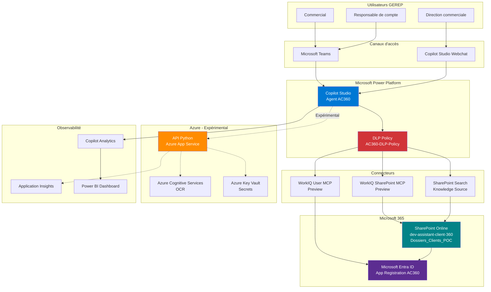
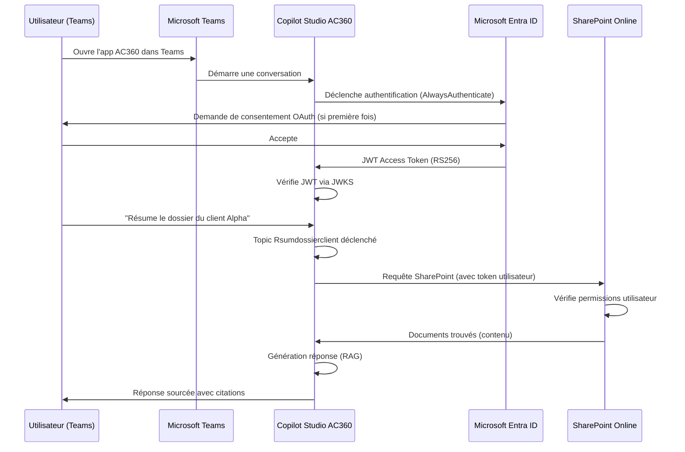
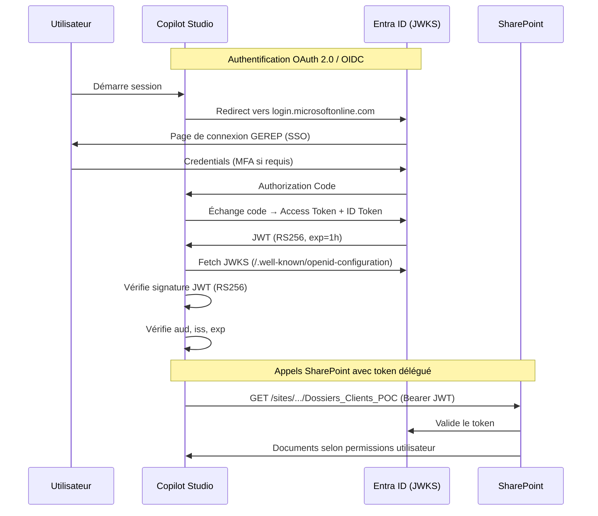
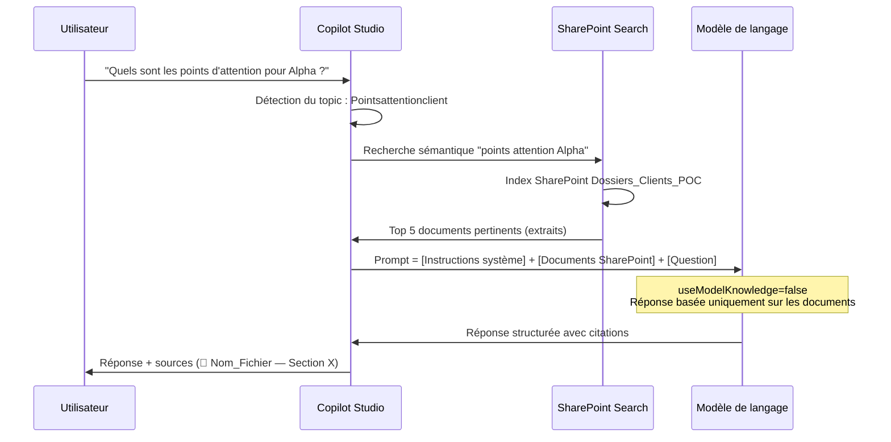
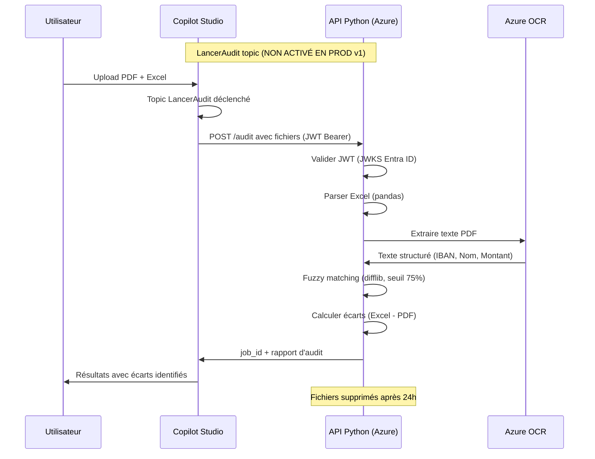

# Architecture Cible — AC360

> **Version** : 1.0  
> **Date** : 2026-06-03  
> **Propriétaire** : DSI + Architecte Digital GEREP  
> **Classification** : Interne

---

## 1. Vue d'ensemble

AC360 est un assistant commercial construit sur **Microsoft Copilot Studio**, intégré à l'écosystème **Microsoft 365** de GEREP. Il accède aux documents clients stockés dans **SharePoint Online** via des connexions OAuth authentifiées par **Microsoft Entra ID**.

---

## 2. Architecture logique

---

## 3. Flux utilisateur (conversation standard)

---

## 4. Flux d'authentification

---

## 5. Flux RAG (Retrieval-Augmented Generation)

---

## 6. Flux API Audit (optionnel — expérimental)

---

## 7. Composants et responsabilités

### Composants actifs (v1)

| Composant | Rôle | Owner | Environnement |
|---|---|---|---|
| **Copilot Studio Agent AC360** | Agent conversationnel, orchestrateur | Admin Power Platform | Power Platform |
| **SharePoint Online** | Source de vérité documentaire | Owner SharePoint | Microsoft 365 |
| **Microsoft Entra ID** | Authentification et autorisation | Owner Entra ID | Azure AD / Entra |
| **Microsoft Teams** | Canal de déploiement principal | Admin Teams | Microsoft 365 |
| **WorkIQ SharePoint MCP** | Connecteur SharePoint (Preview) | Admin Power Platform | Power Platform |
| **SharePoint Search** | Knowledge source RAG | Admin Power Platform | Power Platform |
| **DLP Policy** | Gouvernance des données | Admin Power Platform | Power Platform |

### Composants futurs / expérimentaux (v2+)

| Composant | Rôle | Prérequis activation |
|---|---|---|
| **API Python (Azure App Service)** | Moteur d'audit PDF/Excel | Approbation RSSI + tests complets |
| **Azure Cognitive Services (OCR)** | Extraction texte PDF | Avec API Python |
| **Azure Key Vault** | Gestion des secrets | Recommandé en PROD dès v1 |
| **Application Insights** | Monitoring API | Avec API Python |
| **Microsoft Fabric** | Analytics avancés | Approbation RSSI + service principal |
| **Power BI** | Dashboard de pilotage | Copilot Analytics suffisant en v1 |

---

## 8. Décisions d'architecture clés

| Décision | Choix | Justification | Alternative écartée |
|---|---|---|---|
| Canal principal | Microsoft Teams | Intégration native M365, SSO transparent | Interface web standalone |
| Authentification | Entra ID SSO | Standard GEREP, MFA, délégation OAuth | Service account global |
| Source RAG | SharePoint uniquement | Données gouvernées GEREP, contrôle des accès | Web search, Outlook |
| Connecteur SharePoint | WorkIQ MCP (Preview) | Riche fonctionnellement | HTTP custom (risque DLP) |
| Secrets | Azure Key Vault (cible) | Aucun secret en clair | Variables d'env uniquement |
| Modèle de langage | GPT-4 via Copilot Studio | Gestion par Microsoft, RGPD | GPT Azure direct |

---

*Document d'architecture v1.0 — Valider avec DSI avant déploiement PROD*
