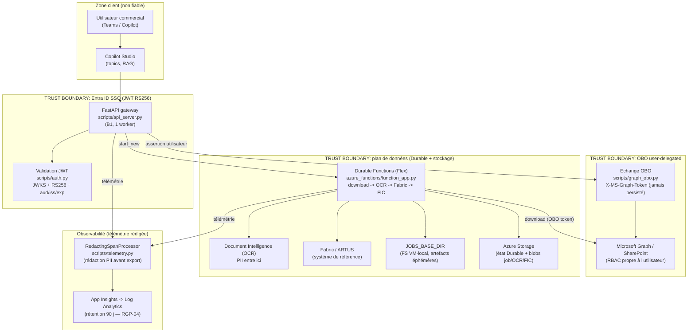
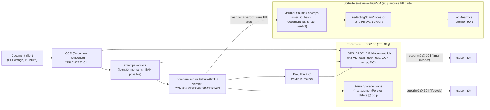

# SEC-01 — Architecture & flux de données (PII / frontières de confiance)

> Livrable **SEC-01** du Security Evidence Pack (Phase 5).
> Diagrammes **Mermaid** (versionnables, rendus par GitHub) : architecture des
> composants + flux de données PII avec frontières de confiance explicites.
> Source : `.planning/phases/05-rgpd-security-evidence-pack/05-RESEARCH.md`
> §"System Architecture Diagram (PII / retention flow)", `CLAUDE.md` §Architecture,
> `docs/security/SECURITY_POSTURE.md`. Diagramme de référence cité par **SEC-03**.
> Date : 2026-06-15.

## But du document

SEC-01 donne à un reviewer (DPO, auditeur sécurité) une vue unique et rendue de la
forme du système AC360 et du **trajet de la PII client** : où elle entre, où elle est
éphémère, où elle ressort (sous forme rédigée), et **quelles frontières de confiance**
elle traverse. C'est l'une des cinq composantes du pack de preuves (SEC-01..SEC-05) et
le diagramme-source référencé par la matrice de couverture des menaces **SEC-03**.

Les contrôles eux-mêmes (authN/authZ) sont décrits et tracés aux tests dans **SEC-02** ;
l'application de la rétention (TTL 30 j artefacts, 90 j logs) est traitée par **RGP-03**
et **RGP-04** — référencés dans les diagrammes ci-dessous.

---

## 1. Diagramme d'architecture (composants & frontières de confiance)

Le diagramme suivant montre les composants porteurs et trois **frontières de
confiance** (`subgraph`) : la frontière Entra ID SSO au gateway, la frontière OBO
(token Graph délégué, jamais persisté) vers Microsoft Graph / SharePoint, et la
frontière du plan de données / stockage.

**Lecture :** la seule entrée non fiable est le JWT porté par l'utilisateur via Copilot
Studio ; il est validé RS256/JWKS à la frontière SSO (`scripts/auth.py`) avant tout
traitement. L'accès SharePoint passe par un token Graph **délégué** (OBO) qui honore les
permissions propres de l'utilisateur — jamais persisté. Toute la télémétrie est rédigée
(`RedactingSpanProcessor`) avant d'atteindre Log Analytics.

---

## 2. Diagramme de flux de données PII (entrée / éphémère / télémétrie rédigée)

Ce second diagramme suit explicitement la **PII** : son point d'entrée (document client
-> OCR), sa nature éphémère (`JOBS_BASE_DIR`, TTL 30 j — **RGP-03**), et le fait que seule
une trace **rédigée et hachée** sort vers la télémétrie (**RGP-04**).

**Points d'application de la rétention (cf. RGP-03 / RGP-04) :**
- **① Blobs Storage** -> `managementPolicies` delete @ `jobRetentionDays` (30) — RGP-03.
- **② `JOBS_BASE_DIR`** -> nettoyeur timer Python age-based @ 30 j — RGP-03 (`scripts/jobs_ttl.py`).
- **③ Log Analytics** -> `retentionInDays = 90` (court, région EU) — RGP-04.

Le journal d'audit ne porte **que 4 champs hachés/non-PII** (`user_id_hash`,
`document_id`, `ts_utc`, `verdict`) — l'`oid` brut ne traverse jamais la frontière de
télémétrie (cf. `SECURITY_POSTURE.md` §6).

---

## 3. Frontières de confiance (Frontières de confiance — prose)

| # | Boundary | Entrée non fiable qui la traverse | Contrôle à la frontière | Preuve (SEC-02 / source) |
|---|----------|-----------------------------------|-------------------------|--------------------------|
| 1 | **Teams/Copilot client -> FastAPI gateway** | JWT porté par l'utilisateur (potentiellement forgé/expiré) | Entra SSO + validation **JWT RS256/JWKS** (audience/issuer/exp/nbf, `kid`/`alg` vérifiés) dans `scripts/auth.py` | SEC-02 §1 -> `tests/backend/test_auth_jwt.py`, `tests/backend/test_auth_jwt_real.py` |
| 2 | **Gateway -> Microsoft Graph (OBO)** | Aucune nouvelle entrée externe ; token utilisateur échangé | Token Graph **délégué** (`scripts/graph_obo.py`) honorant le **RBAC SharePoint** de l'utilisateur ; `X-MS-Graph-Token` **jamais persisté** | SEC-02 §4 -> `tests/backend/test_graph_obo.py`, `tests/backend/test_wave1_auth_identity.py` |
| 3 | **Utilisateur A -> job d'audit de l'utilisateur B (surface IDOR)** | `job_id` arbitraire dans une requête de statut | Garde durable autoritaire `_assert_durable_owner` sur `owner_hash = hash_id(oid)` (403 sur mismatch) | SEC-02 §3 -> `tests/backend/test_audit_ownership.py`, `tests/backend/test_job_isolation.py` |
| 4 | **Pipeline -> plan de données (OCR/Storage/JOBS_BASE_DIR)** | Document client (PII brute) à l'ingestion OCR | Artefacts confinés au plan de données, éphémères (TTL 30 j — RGP-03) ; télémétrie rédigée (RGP-04) | RGP-03 / RGP-04 ; `SECURITY_POSTURE.md` §5/§6 |

**Où la PII entre / sort :**
- **Entre** : à l'ingestion OCR (document client -> Document Intelligence). C'est le seul
  point d'entrée de PII brute.
- **Éphémère** : `JOBS_BASE_DIR/{document_id}` (FS VM-local) et les blobs job/OCR/FIC —
  supprimés à 30 jours (RGP-03).
- **Sort (rédigée)** : uniquement via le `RedactingSpanProcessor` -> Log Analytics, et le
  journal d'audit à 4 champs hachés. **Aucune PII brute** ne franchit la frontière de
  télémétrie ; l'`oid` est haché (SHA-256) avant toute émission.

---

## 4. Renvois

- **SEC-02** — description authN/authZ (chaque contrôle de ce document tracé à un test).
- **RGP-03** — application de la rétention des artefacts (Storage lifecycle + timer cleaner, 30 j).
- **RGP-04** — statut PII-dans-les-logs (RedactingSpanProcessor) + rétention Log Analytics 90 j.
- **SECURITY_POSTURE.md** — §3 (IDOR `oid`), §4 (OBO), §5 (rédaction), §6 (journal 4 champs).
